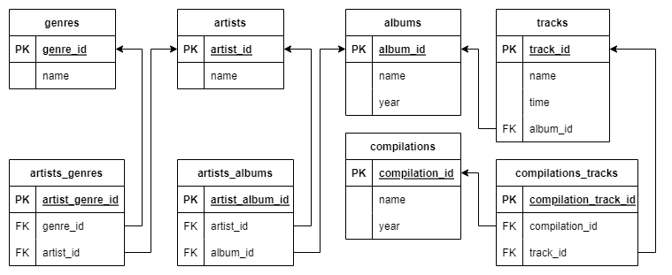

**Часть 1. Задание к лекции «Работа с SQL. Создание БД»**
-
***Задание состоит из двух частей***

1. Спроектировать и нарисовать схему БД 

2. Написать SQL-запросы, создающие спроектированную БД.

Будем развивать схему для музыкального сервиса из предыдущего ДЗ.
Ранее существовало ограничение, что каждый исполнитель поёт строго в одном жанре, пора его убрать. Исполнители могут петь в разных жанрах, как и одному жанру могут принадлежать несколько исполнителей.
Аналогичное ограничение было и с альбомами у исполнителей — альбом мог выпустить только один исполнитель. Теперь альбом могут выпустить несколько исполнителей вместе. Как и исполнитель может принимать участие во множестве альбомов.
С треками ничего не меняем, всё так же трек принадлежит строго одному альбому.
Но появилась новая сущность — сборник. Сборник имеет название и год выпуска. В него входят различные треки из разных альбомов.
Обратите внимание: один и тот же трек может присутствовать в разных сборниках.

***Результат:***

 
**Часть 2. Задание к лекции «Продвинутая выборка данных»**
-
#### Заполните базу данных. В ней должно быть:

- не менее 8 исполнителей,
- не менее 5 жанров,
- не менее 8 альбомов,
- не менее 15 треков,
- не менее 8 сборников.
Внимание: должны быть заполнены все поля каждой таблицы, в том числе таблицы связей исполнителей с жанрами, исполнителей с альбомами, сборников с треками.

#### Написать SELECT-запросы, которые выведут информацию согласно инструкциям ниже.

1. Количество исполнителей в каждом жанре.
2. Количество треков, вошедших в альбомы 2019–2020 годов.
3. Средняя продолжительность треков по каждому альбому.
4. Все исполнители, которые не выпустили альбомы в 2020 году.
5. Названия сборников, в которых присутствует конкретный исполнитель (выберите его сами).
6. Названия альбомов, в которых присутствуют исполнители более чем одного жанра.
7. Наименования треков, которые не входят в сборники.
8. Исполнитель или исполнители, написавшие самый короткий по продолжительности трек, — теоретически таких треков может быть несколько.
9. Названия альбомов, содержащих наименьшее количество треков.

***Результат работы:*** 
1. Схема БД
2. CREATE-запросы
3. INSERT-запросы
4. SELECT-запросы
